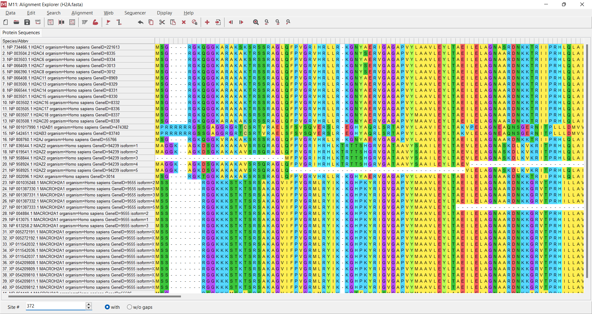
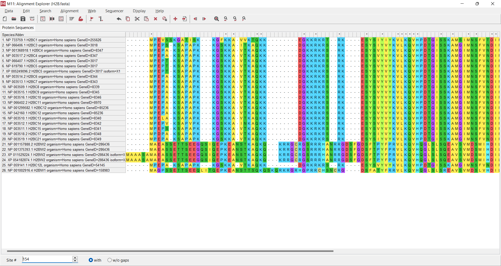
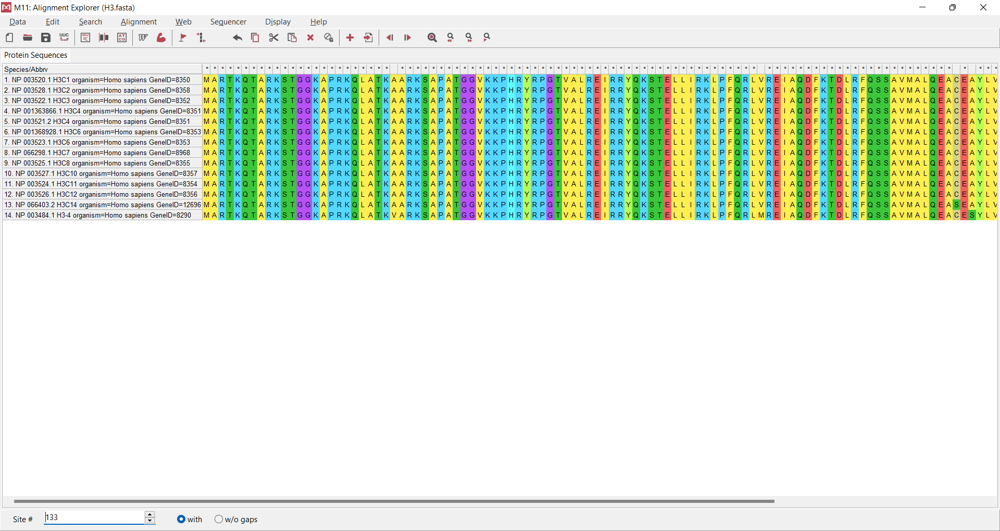
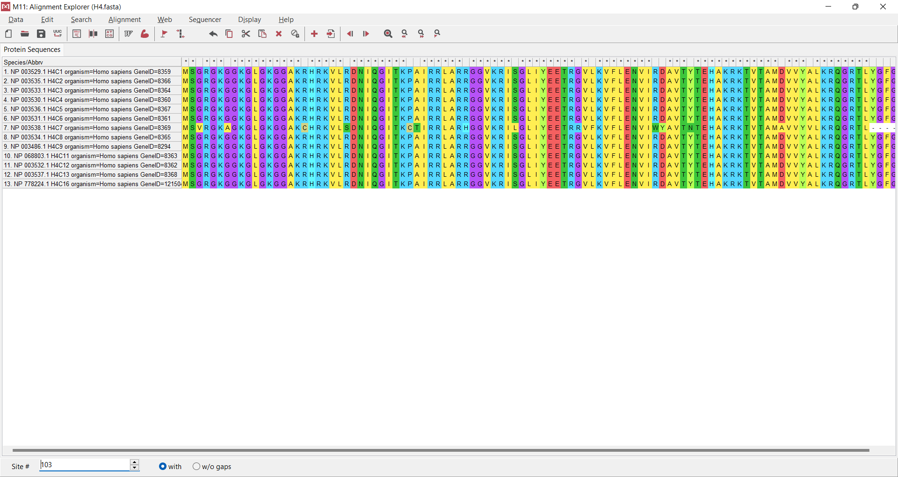
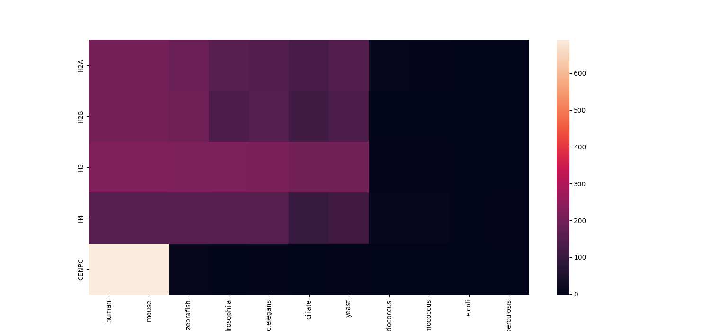

# Индивидуальная часть

## [Ссылка на Colab](https://colab.research.google.com/drive/1Njr3FceQy_jRTxKozN-Anlrj06CTgbhn?usp=drive_link)

## `CENPC`

- **Функция**:
    - `CENPC` рекрутирует фермент `DNMT3B` (ДНК-метилтрансферазу 3B) к центромерным и перицентромерным сателлитным повторам.
      Это означает, что `CENPC` помогает направлять процесс метилирования ДНК в этих областях генома;
    - `CENPC`, совместно с `DNMT3B`, регулирует гистоновый код в центромерных и перицентромерных областях.
      Это включает изменения гистоновых меток, которые характерны для центромерного хроматина
    ([источник](https://www.uniprot.org/uniprotkb/Q03188/entry))
- **Модификация**: ДНК метилирование
- **Продукты**: 5mC
- **Ткани**: костный мозг, лимфоузел и еще 25 других тканей
- **[FASTA](https://www.ncbi.nlm.nih.gov/protein/NP_001803.2?report=fasta)**

## Выравнивания

|     |                       |
|-----|-----------------------|
| H2A |  | 
| H2B |  |
| H3  |   |
| H4  |   |

После выравнивания видно, что для каждого гистона последовательности очень похожи,
поэтому можно считать их просто копиями друг друга и выбирать любые для дальнейших действий

## E-value

### Абсолютные значения

|         | `human`   | `mouse`   | `zebrafish` | `drosophila` | `c\.elegans` | `ciliate` | `yeast`   | `methanocaldococcus` | `thermococcus` | `e\.coli` | `tuberculosis` |
|---------|-----------|-----------|-------------|--------------|--------------|-----------|-----------|----------------------|----------------|-----------|----------------|
| `H2A`   | 2\.07e-89 | 3\.8e-89  | 5\.78e-82   | 2\.89e-68    | 9\.21e-66    | 2\.97e-57 | 1\.82e-63 | 0\.000491            | 0\.003         | 1\.3      | 0\.45          |
| `H2B`   | 2\.78e-88 | 1\.95e-88 | 1\.86e-83   | 2\.75e-60    | 5\.98e-66    | 4\.62e-51 | 1\.01e-60 | 1\.7                 | 1\.2           | 1\.6      | 2\.3           |
| `H3`    | 2\.19e-96 | 1\.54e-96 | 1\.77e-95   | 9\.39e-96    | 4\.46e-94    | 8\.41e-86 | 3\.31e-87 | 0\.034               | 0\.057         | 0\.9      | 4\.6           |
| `H4`    | 1\.09e-67 | 7\.6e-68  | 1\.13e-68   | 8\.02e-68    | 6\.15e-68    | 1\.96e-45 | 1\.08e-52 | 8\.22e-05            | 3\.31e-05      | 1\.3      | 0\.069         |
| `CENPC` | 1e-300    | 1e-300    | 0\.000293   | 4\.3         | 0\.017       | 1\.3      | 0\.068    | 3\.9                 | 5\.3           | 0\.36     | 0\.44          |

### Прологарифмированные значения

|         | `human`             | `mouse`             | `zebrafish`         | `drosophila`         | `c\.elegans`        | `ciliate`             | `yeast`             | `methanocaldococcus` | `thermococcus`       | `e\.coli`             | `tuberculosis`       |
|---------|---------------------|---------------------|---------------------|----------------------|---------------------|-----------------------|---------------------|----------------------|----------------------|-----------------------|----------------------|
| `H2A`   | 204\.2025246691928  | 203\.59507220973774 | 187\.05757394282745 | 155\.51452982147077  | 149\.7503262873398  | 130\.15878834784598   | 144\.46402435753618 | 7\.619066430169753   | 5\.809142990314028   | -0\.26236426446749106 | 0\.7985076962177716  |
| `H2B`   | 201\.60503725577348 | 201\.95965881090038 | 190\.49398623078068 | 137\.14350466796427  | 150\.18219556964448 | 115\.90144503760268   | 138\.14515524878956 | -0\.5306282510621704 | -0\.1823215567939546 | -0\.47000362924573563 | -0\.8329091229351039 |
| `H3`    | 220\.2642673836     | 220\.61638651100284 | 218\.1746042878486  | 218\.80852363420823  | 214\.94784997540833 | 195\.89289652350308   | 199\.127954901093   | 3\.3813947543659757  | 2\.864704011147587   | 0\.10536051565782628  | -1\.5260563034950492 |
| `H4`    | 154\.18702353436    | 154\.54763807630283 | 156\.45356869087087 | 154\.4938479017167   | 154\.75933424177668 | 102\.94338471148963   | 119\.65746379455425 | 9\.40635525590214    | 10\.315977275581258  | -0\.26236426446749106 | 2\.6736487743848776  |
| `CENPC` | 690\.7755278982137  | 690\.7755278982137  | 8\.135337948947207  | -1\.4586150226995167 | 4\.074541934925921  | -0\.26236426446749106 | 2\.6882475738060303 | -1\.3609765531356006 | -1\.667706820558076  | 1\.0216512475319814   | 0\.8209805520698302  |

## Тепловая карта

## Вывод

Сходство наблюдается только у human и mouse, у остальных организмов отсутствует.
Поэтому можно сделать вывод, о том что мой белок появился в эволюции, начиная с млекопитающих
